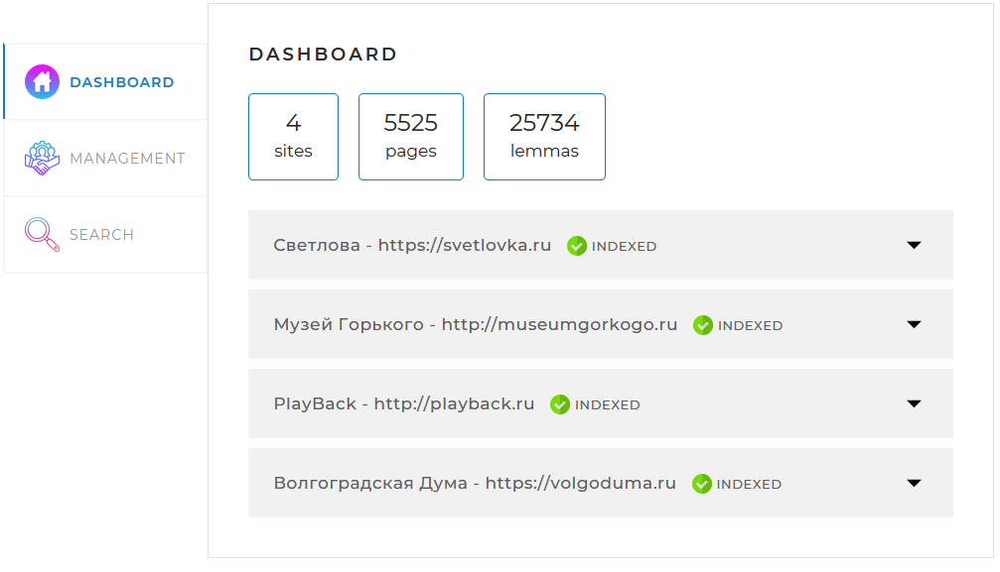
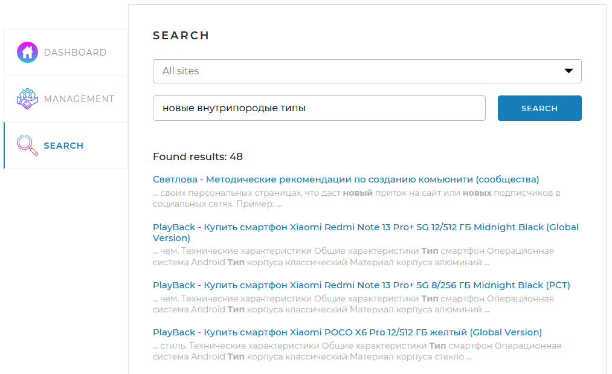

## Поисковая система сайта

Приложение для анализа указанного сайта (или нескольких сайтов) с целью обеспечения поиска по сайту
## Технологии

- **Java 17**
- **Spring Boot 2.7.1**
- **Maven**
- **PostgreSQL**
- **Fork-Join Java Framework**
- **Apache Lucene Morphology**
- **JSOUP**
- **Lombok**

Веб-интерфейс приложения представляет собой одну веб-страницу с тремя вкладками.
- **Dashboard** – эта вкладка открывается по умолчанию. На ней отображается общая статистика по всем сайтам, а также детальная статистика и статус по каждому из сайтов.

- **Management** – На этой вкладке находятся инструменты управления поисковым движком, запуск и остановка полной индексации, а также возможность добавить (обновить) отдельную страницу по ссылке.

- **Search** – Данная вкладка предназначена для поиска страниц. На ней находятся выпадающий список с выбором сайта для поиска и поле поиска, а при нажатии на кнопку «Search» производится поиск с последующей выдачей результатов.

## Как работает поисковая система

- в файле конфигурации указываются адреса сайтов для поиска
- поисковая система обходит все страницы указанных сайтов и индексирует их, чтобы затем находить наиболее релевантные страницы для любого поискового запроса
- пользователь отправляет поисковые запросы через API поисковой системы
- поисковый запрос преобразуется определенным образом в список слов, переведенных в базовую форму, по которым страницы ищутся в ранее сформированном индексе
- пользователь получает ранжированные и отсортированные результаты поиска

## Запуск приложения

- установите Java 17+ и сервер PostgreSQL
- создайте пустую базу данных search_engine
- скачайте jar-файл и конфигурационный файл 
- укажите в конфигурационном файле application.yaml параметры подключения к базе данных в разделе spring.datasource: имя пользователя, пароль
- укажите в конфигурационном файле application.yaml сайты для индексации
- запустите приложение, запустив jar-файл из командной строки: java -jar SearchEngine-1.0.jar
- перейдите по адресу http://localhost:8080/ в браузере